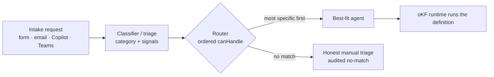
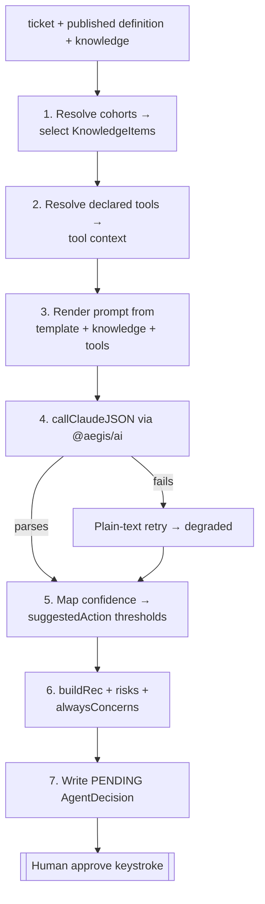
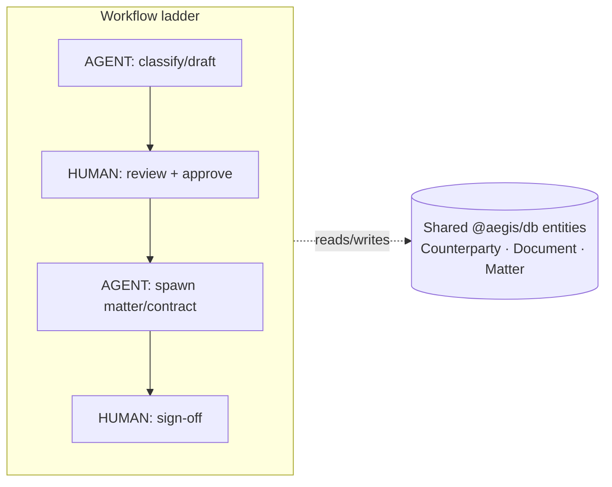
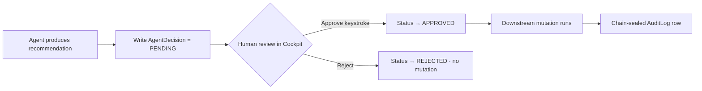

# AEGIS — AI Agent Architecture

How AEGIS's AI agents are orchestrated, how they hold and share state, how
they select and run tools, and how the platform keeps every AI action
governed and defensible.

This is a description of the **actual system**, not a target. Every claim
below maps to code you can open; representative paths are cited inline.

---

## 0. The one principle everything else serves

> **Every AI action that mutates state requires a human approval and writes a
> cryptographically chained audit entry.** The agent's job is to *recommend*;
> a person's approve keystroke is the only thing that lets a recommendation
> become an action.

The agent definition configures **what** an agent does (its knowledge,
prompt, model params, routing, thresholds, tools). The **execution harness is
code** and can never be configured to remove the human gate. *Configurable
spec, non-negotiable harness.*

---

## 1. Agent orchestration flow

### 1.1 What "an agent" is

AEGIS ships **11 intake agents** (NDA, Vendor Intake, Contract-Type
Specialist, Contract Review, Trademark, Litigation, Notice Management,
Privacy, Marketing, FAQ, Policy Q&A). None is a hardcoded black box — each is
a **data-driven definition** in the Open Knowledge Format (oKF):

- `AgentDefinition` — identity, routing rules, model params, prompt template,
  output thresholds, approver risks, `executionMode`, declared `tools`.
- `KnowledgePack` → `KnowledgeItem` — the agent's knowledge (clauses, Q&A,
  templates, rules), addressable by stable "clause codes", sliceable by
  `KnowledgeCohort`.

A single **generic runtime** (`modules/intake/src/agents/okf/runtime.js`)
executes *any* definition. The eleven agents are configuration over one
engine, not eleven engines.

### 1.2 Routing — one best-fit agent per request (not a swarm)

AEGIS deliberately does **not** run every agent on every request. A request
is routed to the **single most-specific agent** that can handle it:

Routing order is meaningful and deterministic (`modules/intake/src/agents/index.js`):
the **Contract-Type Specialist** runs *before* the generalist **Contract
Review** so a typed contract (MSA/DPA/SaaS) gets its specific playbook; only
unmatched types fall through. NDAs are excluded from the contract path and go
to the **NDA agent**. A request no agent claims becomes honest manual triage
with an audited no-match — never a fabricated answer.

### 1.3 How the runtime runs one agent

`runDefinition(ticket, def, knowledge, deps)` is a fixed pipeline:

The same harness gives **every** agent the same reliability property: the
structured JSON call is tried first; on truncation/timeout it retries as
plain text (prose can't truncate into an unparseable object); only if both
fail does it degrade to a holding response. No agent silently fabricates.

### 1.4 How agents coordinate

Agents **do not call each other directly**. Coordination happens through two
shared substrates:

1. **Shared entities (the "one brain").** Every module reads/writes the same
   `Counterparty`, `Person`, `Document`, `Obligation`, `Event` rows in
   `@aegis/db`. The NDA agent checks the counterparty relationship; the
   Litigation agent pulls prior matters/agreements for the same counterparty.
   They "coordinate" by operating on shared truth, not by messaging.
2. **Workflow ladders + hand-off.** Multi-step governance flows
   (`@aegis/workflow`) chain **AGENT** steps and **HUMAN** steps. An AGENT
   step invokes an agent; the result advances the ladder only through a
   server-enforced stage transition (`intake.ticket.stage_advanced`
   audited). The **baton-pass / hand-off model** moves a ticket between
   agents and humans as a first-class, audited transition — the closest
   thing to agent-to-agent coordination, and it always routes through the
   governed store.

Approving a workflow that ends in matter-creation calls
`@aegis/matter.createMatter` and links the ticket — cross-module composition
through public `api.ts` surfaces, never through another module's internals.

---

## 2. State management & memory

### 2.1 Agents are stateless; the platform holds the state

An agent invocation is a pure function of `(ticket, published definition,
resolved knowledge)`. There is **no agent-local memory** between runs. All
durable state lives in Postgres via `@aegis/db`:

| State | Where | Shape |
|---|---|---|
| Request lifecycle | `IntakeTicket.status` | state machine (NEW → … → ESCALATED / CLOSED) |
| **AI decision lifecycle** | `AgentDecision` | PENDING → APPROVED / APPROVED_WITH_OVERRIDE / REJECTED |
| Agent knowledge ("long-term memory") | `KnowledgePack` / `KnowledgeItem` / `KnowledgeCohort` | versioned, addressable |
| Shared facts (the brain) | `Counterparty`, `Person`, `Document`, `Obligation`, `Event` | polymorphic shared entities |
| Immutable history | `AuditLog` (chained), `AgentDefinitionVersion`, `KnowledgePackVersion` | append-only snapshots |

### 2.2 "Memory" = the shared, versioned knowledge base

What a general LLM would keep in a context window, AEGIS keeps as **governed,
editable, versioned data**:

- **Knowledge retrieval is scoped, not dumped.** The runtime resolves
  `KnowledgeCohort` selectors against the ticket and injects only the
  matching `KnowledgeItem`s into the prompt (e.g. the Contract-Type
  Specialist loads only the playbook whose cohort matches the contract type).
  Untagged items are always-on; tagged items load only when their cohort
  matches.
- **Every knowledge/definition change is versioned and revertible.** A
  publish freezes an immutable `AgentDefinitionVersion` /
  `KnowledgePackVersion` (full canonical oKF JSON + content hash). History +
  revert + export/import round-trip are first-class.
- **One store, edited two ways.** The Contracts 📖 Playbook and 📄 Templates
  screens and the Agent Designer's Knowledge tab read/write the *same* packs —
  there is no second source of truth to drift.

### 2.3 Resilience state

The degraded path (§1.3) is itself a state contract: a recommendation is
tagged as full, plain-text-fallback, or degraded, so downstream UI and
reviewers always know *how much* the AI could actually assess. Confidence is
`null` where there is no model behind an output (honest signalling).

---

## 3. Tool selection

### 3.1 Tools are **declared**, not model-invented

AEGIS does **not** use open-ended, model-chosen function calling where the LLM
decides at runtime which tools to invoke. That is a deliberate governance
decision: free-form tool-calling is hard to audit and easy to misuse.

Instead:

- An agent definition **declares** its tools: `agent.tools: ["counterparty"]`.
- Before the Claude call, the runtime **resolves every declared tool** into
  `{{tool.<name>}}` context variables (`resolveTools`,
  `runtime.js`). The model sees the tool *output* as context; it never
  chooses to call a tool.
- **Tools provide CONTEXT, never a gate.** A tool that fails degrades to
  `"(name: unavailable)"` — the agent still runs. Tools can inform a
  recommendation; they can never *be* the approval.

### 3.2 `executionMode` splits pure-prompt from deterministic-gating agents

The decisive design line is **where a deterministic step must GATE the
action** vs merely inform it:

| `executionMode` | Meaning | Examples |
|---|---|---|
| `"okf"` | Runs entirely from the definition: knowledge + declared tools → Claude → thresholds. Tools add context. | Contract Review (clause knowledge), Litigation (counterparty record pull as a tool + `alwaysConcerns` for the mandatory legal-hold flag) |
| `"code"` | Keeps a deterministic step in code because that step must **gate/route** the action, not just add context. Still reads its oKF knowledge/config. | Vendor (sanctions hit → escalate), Notice (deadline math → SLA), Trademark (phonetic + visual + NICE-class knock-out screen), Privacy/Marketing (claim/route detection) |

Rule of thumb encoded in the architecture: **if a step's result must change
the routing or block the action, it stays `code`.** Widening the `okf` set for
a gating agent would require a *gating primitive* in the runtime — not just a
context tool. `alwaysConcerns` are deterministic concerns prepended to every
recommendation so mandatory warnings (e.g. "evaluate preservation now")
survive even the degraded path.

### 3.3 Worked example — Trademark clearance

The Trademark agent is `executionMode: "code"` because its core is a
**deterministic knock-out screen** that must decide the outcome, not decorate
it: `normalize → Soundex (phonetic) + Levenshtein (visual) + NICE-class
overlap` against the registered-marks table, thresholded to real conflicts.
An AI memo then *interprets* the deterministic hits, and the agent **always**
recommends a formal USPTO/EUIPO/WIPO search. The registry integrations are
real clients behind an env-gated factory. The determinism is the point: the
same mark always screens the same way, and the screen — not the model —
decides "conflict vs clear".

---

## 4. Security & governance of the AI agents

Governance is enforced in the **schema and the harness**, not in a prompt.

### 4.1 The human gate (Differentiator #7)

Every Claude-generated recommendation writes a **PENDING** `AgentDecision`.
Downstream mutations gate on `APPROVED` (or `APPROVED_WITH_OVERRIDE`). The
gate is enforced at the persistence layer — e.g. `recordHoldEvent` refuses a
caller whose `agentDecisionId` is still `PENDING` (`AgentDecisionPendingError`).
No oKF field, threshold, or prompt edit can bypass it.

### 4.2 Tamper-evident audit chain (Differentiator #11)

Every state-changing action writes an `AuditLog` row via `logAudit`. The
table is **append-only at the database level** (Postgres triggers reject
UPDATE/DELETE) and **cryptographically chained**: each row carries
`chainPosition`, `prevHash`, and a `contentHash` computed over its content +
the prior hash. `verifyAuditChain(orgId)` recomputes the chain to localise
any tampering — and detection does *not* depend on the triggers staying
intact. A CI `db-integrity` job re-proves the chain on every PR.
`exportAuditDefensibilityReport` produces court-ready evidence (PDF + JSON
with each row's verbatim canonical content). This applies to agent actors
exactly as to humans — every external/AI action is on the chain.

### 4.3 Access control

- **RBAC on every surface.** `canUserDo` / `assertUserCanDo` gate both the UI
  affordance and the authoritative server mutation — no "trust the client"
  path. The Agent Designer is gated by `admin:agents:manage`; some
  permissions are resource-scoped (e.g. matter assignment, ticket ownership).
- **`admin` is a guaranteed superset.** A module-load guard asserts the
  admin bundle equals the full `Permission` enum, and `AdminSupersetViolationError`
  blocks reducing it. Admin permissions resolve from code, so adding a new
  permission never silently locks admins out of the new feature.

### 4.4 Containment & honesty

- **All AI calls go through `@aegis/ai`** → the `/api/claude` server proxy, so
  the Anthropic key never reaches the browser.
- **All data access goes through `@aegis/db`** — no module builds its own
  Prisma client, no raw SQL outside the DB package.
- **Module isolation** (ESLint `no-restricted-paths`) means an agent module
  can only reach another module through its public `api.ts`, never its
  internals — a hard blast-radius boundary.
- **Honest failure.** Agents degrade to a holding response rather than
  fabricate; `productionReady:false` mock agents are hidden in production so a
  customer never sees fabricated analysis.

### 4.5 Governance summary

| Layer | Guarantee | Enforced by |
|---|---|---|
| Action | No AI mutation without human approval | PENDING `AgentDecision` + approve keystroke |
| Evidence | Every action tamper-evident & exportable | Chained `AuditLog` + triggers + `verifyAuditChain` |
| Access | Every affordance + mutation authorized | `canUserDo` / `assertUserCanDo`, resource scopes |
| Tools | Deterministic gating steps can't be prompted away | `executionMode` code/okf split; tools = context only |
| Containment | Key server-side; data + modules bounded | `@aegis/ai` proxy, `@aegis/db`, module isolation |
| Change | Every config/knowledge edit versioned & revertible | `AgentDefinitionVersion`, `KnowledgePackVersion` |

---

## 5. One-paragraph brief for stakeholders

AEGIS runs a fleet of eleven configurable AI agents over a single execution
engine. Each request is routed to the one best-fit agent, which drafts a
recommendation from versioned, org-editable knowledge — never from a black
box. Agents hold no private memory: all state lives in a shared, audited
Postgres brain, so every agent reasons over the same governed facts. Tools are
declared and resolved deterministically as context, and any step that must
*decide* an outcome stays in code, not the model. Nothing an agent produces
becomes an action until a human approves it, and every step — AI or human — is
sealed into a tamper-evident cryptographic audit chain that exports as
court-ready evidence. Conservative AI governance isn't a feature bolted on;
it's the architecture.
