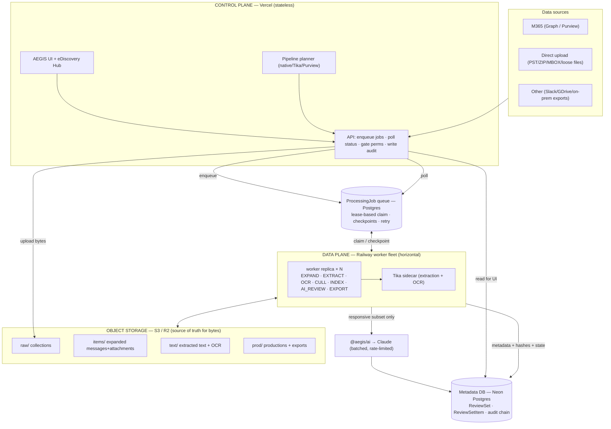

# AEGIS Processing Platform — Complete Plan & Architecture

> Goal: ingest, process, **cull**, and AI-review large eDiscovery datasets
> (target: **1 TB / ~5–15 M documents per matter**) — faster and cheaper
> than Microsoft Purview, defensible end-to-end, and license-aware (native
> Tika mode *or* Purview mode per client). This document is the source of
> truth for the processing data plane; it sits alongside
> [`processing-roadmap.md`](./processing-roadmap.md) (feature checklist) and
> [`scale-worker-runbook.md`](./scale-worker-runbook.md) (Railway ops).

---

## 1. Design principles (the non-negotiables)

1. **Vercel is the control plane, never the data plane.** The Next.js app
   orchestrates, gates permissions, writes audit, and *polls* job state. It
   never holds a terabyte, never unzips a PST, never blocks on a long run.
2. **Railway worker fleet is the data plane.** Stateful, long-running,
   horizontally scaled. All heavy work (expand, extract, OCR, cull, index,
   AI review) happens here.
3. **Everything is a checkpointed job.** Every stage is a `ProcessingJob`
   row that is idempotent and resumable — a worker crash at hour 20 of a
   30-hour run resumes from its cursor, never restarts.
4. **Object storage is the source of truth for *bytes*; Postgres for
   *state*.** Raw collections, expanded items, and extracted text live in
   S3/R2; Postgres holds only metadata, hashes, and job state. You never
   stream a terabyte through Postgres or Vercel.
5. **Cull hard *before* AI review.** You never AI-review raw 1 TB.
   Deterministic culling (hash-dedup, deNIST, date-window, family/thread
   suppression, near-dup) collapses 1 TB to a single-digit-% responsive set
   *first*; AI runs only on what survives. This is both the cost story and
   the Purview-beating story.
6. **Every action is chain-sealed audited.** Collection, expansion,
   extraction, cull decisions, AI verdicts, human overrides, export — all on
   the D11 audit chain. The defensibility moat.
7. **Capability-aware routing.** The pipeline planner (already built —
   B1/B2/B3/B6) picks native / Tika / Purview per *stage* per *matter* from
   the client's license + connection state. One control plane, three engines.

---

## 2. Current state (what exists today)

| Layer | Status |
|---|---|
| Control plane (Next.js on Vercel) + permissions + audit chain | ✅ shipped |
| **Pipeline planner** (capabilities → per-stage engine/economics) B1/B2/B3/B6 | ✅ shipped |
| **Blob upload** for large files (bypasses Vercel's ~4.5 MB request cap) A2 | ✅ shipped |
| **Parallel extraction** (bounded concurrency) A5 + benchmark A6 | ✅ shipped |
| **Tika sidecar** on Railway (extraction + OCR) + dual-mode engine factory | ✅ shipped |
| **Worker runbook** (Railway) A7 | ✅ shipped (docs) |
| **`ProcessingJob` queue** (schema + claim/complete/lease/retry service) A1 | 🟡 built, **migration-hold** (PR #394 — apply on Neon then merge) |
| Purview eDiscovery (collection + hold) | ✅ works · read-back **Microsoft-blocked** (portal-gated export) — native mode is the workhorse |
| Review pipeline (dedup / deNIST / threading / near-dup / cull / AI multi-dim tags / reviewer parity / validation runs / batching+QC) | ✅ shipped (single-node scale) |

**The gap between here and 1 TB:** today the archive-ingest path caps a
single archive at **40 MB and loads it whole into RAM**
(`archive-ingest.ts`). That is the deliberate stop before the streaming
worker path. Closing it is Phase 2 (A3) below.

---

## 3. Target architecture



**Read it as:** bytes go to object storage; *pointers + state* go to
Postgres; Vercel only ever enqueues and polls; the Railway fleet does all
the work and scales by adding replicas that fan out over the queue.

---

## 4. Components

| Component | Tech | Role | Scale notes |
|---|---|---|---|
| **Control plane** | Next.js / Vercel | Orchestrate, gate, audit, poll | Stateless; scales for free. Never heavy. |
| **Object storage** | S3 or Cloudflare R2 | Bytes: raw, expanded items, extracted text, productions | R2 = zero egress → cheaper for read-heavy processing. Source of truth for chain-of-custody hashes. |
| **Job queue** | `ProcessingJob` (Postgres) | Durable, checkpointed work units | `FOR UPDATE SKIP LOCKED` → N workers fan out, never double-run. Lease reclaim on worker death. Already built (A1). |
| **Worker fleet** | Railway (Node) | Runs job kinds; bounded per-worker concurrency (A5) | Horizontal: 1 → 10+ replicas. Each ≥2–4 GB RAM. Autoscale on queue depth. |
| **Tika sidecar** | Apache Tika on Railway | Text extraction + OCR for 1000+ formats | Separate service; scale independently. Private networking. |
| **Metadata DB** | Neon Postgres | `ReviewSet`, `ReviewSetItem`, jobs, audit chain | Size compute tier to row volume (10M+ items). Partition/index for the big table. |
| **AI review** | `@aegis/ai` → Claude | Multi-dimension responsive/priv/PII tagging | Batched + concurrency-capped + **cull-gated** (only responsive subset). Cost guard per matter. |
| **Purview connector** | Graph `security` ns | Optional per-license collection/hold/process | Planner routes to it when client has E5 + prefers in-tenant. |
| **Audit chain** | `@aegis/db` D11 | Chain-sealed every action | Immutable, exportable defensibility report. |

---

## 5. The pipeline (stages = job kinds)

Each stage is an idempotent, checkpointed `ProcessingJob.kind`. A parent job
fans out child jobs; children checkpoint a cursor.

```
COLLECT      pull from source → raw/ in object storage           (A4)
  ↓
EXPAND       stream PST/ZIP/MBOX → items/ (never load whole)      (A3)  ← TB unlock
  ↓
EXTRACT      item bytes → text/ (Tika/native), per-item hash      (A5, fan-out)
  ↓
OCR          image/scanned PDFs → text (Tika OCR)                 (fan-out, slower pool)
  ↓
CULL         hash-dedup · deNIST · date-window · family/thread ·  (deterministic, cheap)
             near-dup → mark excluded, defensible exclusion log
  ↓
INDEX        searchable index + language/date facets
  ↓
AI_REVIEW    responsive subset only → Claude multi-dim tags       (batched, rate-limited)
  ↓
QC           human first-pass + second-level QC (reviewer parity)
  ↓
EXPORT       production set → prod/ (load file, natives, images)   (A8)
```

**Why this order wins:** COLLECT→EXPAND→EXTRACT→CULL is all deterministic
and cheap. Only after culling — typically to **1–8% responsive** — does the
expensive LLM run. Purview charges you per-GB to *process* the whole
terabyte before you cull; AEGIS culls first and pays LLM cost on the survivors.

---

## 6. Build plan (phased, mapped to PRs)

### Phase 0 — Foundation ✅ (done)
Planner (B1/B2/B3/B6), Blob upload (A2), parallel extraction (A5),
benchmark (A6), worker runbook (A7), queue schema+service (A1, held).

### Phase 1 — Turn on the queue + worker runtime  *(unblocks everything)*
- **Apply A1 migration on Neon** → merge PR #394.
- **Worker entrypoint** (`scripts/run-worker.ts`): claim → dispatch by
  `kind` → heartbeat → checkpoint → complete/fail. Deploy on Railway per A7.
- **Enqueue + poll surface**: `/api/processing/jobs` (enqueue, list, status)
  gated by permission; job dashboard in the eDiscovery Hub.
- *Acceptance:* a job enqueued from the UI runs on Railway, checkpoints, and
  survives a worker restart.

### Phase 2 — A3: streaming/chunked ingest  *(the 1 TB unlock)*
- Stream PST/ZIP/MBOX **off object storage** — never hold the whole archive.
  `pst-extractor` folder-walk streamed; ZIP central-directory streamed;
  MBOX line-streamed.
- Write expanded items to `items/` + one `ReviewSetItem` per message/attachment
  with a resume cursor on the job so a 30 GB PST resumes mid-folder.
- Remove the 40 MB cap on the worker path (keep it on the Vercel inline path).
- *Acceptance:* ingest a 30 GB PST end-to-end on a single worker.

### Phase 3 — A4: job-driven collection + fan-out extraction
- COLLECT job pulls from M365/Purview/upload into `raw/`.
- EXPAND fans out one EXTRACT child per item batch; OCR routed to a separate
  slower pool. Bounded concurrency per worker (A5) × replicas.
- *Acceptance:* collect + extract a multi-custodian matter across ≥3 workers.

### Phase 4 — Cull-at-scale + index
- Move dedup/deNIST/date/thread/near-dup to a CULL job over the item table
  (streaming, batched) with a defensible exclusion log per decision.
- Build the searchable INDEX (Postgres FTS to start; pluggable to OpenSearch
  if volume demands).
- *Acceptance:* 1 TB-shaped synthetic set culls to a responsive subset with a
  complete, chain-sealed exclusion log.

### Phase 5 — AI review at scale
- Batch AI_REVIEW over the *culled* set; per-matter **cost guard** (token
  budget + docs cap) and rate-limit backoff (reuse queue retry).
- Validation-run gating already exists (pilot→validate→scale, fail-closed on
  uncited/low-confidence). Wire it as the scale gate.
- *Acceptance:* AI-review a responsive subset with cost + recall/precision
  reported before scale-apply.

### Phase 6 — Export / production (A8)
- EXPORT job assembles production (load file + natives + images + text) to
  `prod/`; Bates numbering; privilege/redaction honored; chain-sealed.
- RelativityOne push (HARD-3) as an optional target.
- *Acceptance:* defensible production package downloadable, hash-verified.

### Phase 7 — Horizontal scale + observability
- Autoscale worker replicas on queue depth; separate OCR pool.
- Metrics (docs/min, queue depth, lag, cost) + job dashboard + alerts.
- *Acceptance:* linear throughput scaling verified 1→N workers.

### Phase 8 — Hardening
- **KMS** envelope encryption of stored secrets (HARD-1, sunset the plaintext
  crypto exception before first paying client).
- Data residency modes (in-tenant Purview vs sidecar), private networking,
  DR/resume runbook, retention/purge.

---

## 7. Scaling math — worked 1 TB example

Assume 1 TB ≈ **10 M documents** (email-heavy, ~100 KB avg).

| Stage | Rate (per worker) | 1 worker | 8 workers |
|---|---|---|---|
| EXTRACT (native/Tika, no OCR) | ~400–800 docs/min | ~15–17 days | **~2 days** |
| OCR (scanned subset, say 10%) | ~60–120 docs/min | (separate pool) | size to SLA |
| CULL (deterministic, batched) | ~10k+ docs/min | hours | hours |
| AI_REVIEW (**culled** to ~5% = 500k docs) | rate-limit bound | — | days, cost-capped |

**Takeaways:**
- Extraction is embarrassingly parallel → throughput scales linearly with
  worker count. 8–10 replicas turns "weeks" into "days."
- **Culling is what makes AI tractable:** 10 M → ~500 k means you pay LLM
  cost on 5%, not 100%.
- Bottlenecks to provision deliberately: **worker count** (extraction),
  **OCR pool size** (scanned docs), **Claude rate limits + token budget**
  (AI review), **Neon compute tier** (10 M-row table), **object-storage
  egress** (use R2 to zero it).

---

## 8. Cost model (vs Purview)

| Cost driver | AEGIS (native mode) | Purview |
|---|---|---|
| Processing | Railway compute (hours × replicas) — flat, predictable | **Per-GB** processing charge on the *whole* dataset |
| Licensing | No E5/eDiscovery Premium required | E5 + eDiscovery Premium per custodian |
| AI review | Claude tokens on **culled subset only** | Add-on / limited |
| Storage | S3/R2 (R2 = no egress) | In-tenant |
| **Shape** | Cull-first → pay AI on 5% | Process-all → pay per-GB up front |

This is the **~30% savings vs linear human review** argument in the Samsung
deck: deterministic cull + AI-on-survivors, no per-GB tax, no E5 floor.

---

## 9. Security, residency, defensibility

- **Chain-of-custody:** every collected item hashed at collection; every
  stage decision chain-sealed (D11). Exportable defensibility report.
- **Residency:** planner routes in-tenant (Purview) when the client requires
  data never leave M365; sidecar (Tika) otherwise. Same UI, same audit.
- **Secrets:** KMS envelope encryption (Phase 8) replaces the dev-only
  plaintext crypto before any paying client.
- **Network:** Tika + workers on Railway private networking; only Vercel
  holds public endpoints.

---

## 10. Observability & ops

- **Job dashboard:** queue depth, per-kind throughput, failures, cost-to-date
  per matter (poll `getProcessingQueueCounts` + per-job progress).
- **Alerts:** stuck jobs (heartbeat lease expiry), rising failure rate,
  cost-guard trips.
- **DR/resume:** jobs are checkpointed + idempotent; a fleet restart drains
  the queue from where it stopped. No manual replay.

---

## 11. Bottom line

- **Architecturally, yes — this platform processes 1 TB.** That is precisely
  why the design is queue + persistent worker fleet + object storage +
  horizontal scaling, not serverless.
- **The critical path is short:** apply A1 → **A3 streaming ingest** (the real
  unlock) → A4 collection/fan-out → cull-at-scale → AI-at-scale → export,
  then scale replicas and harden.
- **The winning pitch is not "we AI-review a terabyte."** It's *"we cull a
  terabyte deterministically and cheaply, then AI-review only what's
  responsive"* — faster and far cheaper than Purview's per-GB model, fully
  defensible.
